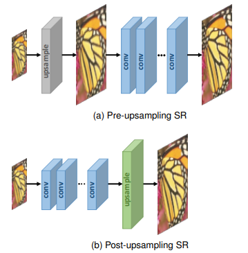

# Make your image better with this git

**Git Progress:**
          
          v.0.0
          1. Researched about esdr
          2. Understanding of the code
          3. Change the data.py file (Data generator)
          
          v0.1
          1. Training of edsr on custom dataset (I used Medical Imaging dataset you can find data below in gdrive.)

1. Download the dataset from Gdrive

        https://drive.google.com/drive/folders/1zKEvX3ubm19kHdWFQEpD6T-0NlCE6opp?usp=sharing

2. Training of Edsr

        This notebook help you in training edsr on your custom dataset like I used brain mris. I got images with 600 by 600 diminsion, Firstly I downsize them by 2x factor (300,300) now I got my low resoltion images as well as high resolution images, than I just feed them edsr model to make an image with diminsion (300,300) to (600, 600)

## Edsr model 

### Images I used for the training purpose

### Training Logs

### Nvidia GPU logs

Hardware and software compatibility of this code will be.

    3070 RTX nvidia
    Intel 10400F processor (CPU)
    Ubuntu 18.04
    tensorflow 2.0

# Things to do

1. Will merge more models 
2. Fuse multiple model weights into one

# Took Help from 

1. Edsr Git https://github.com/krasserm/super-resolution
2. Tensorflow Documentation
3. Stack Overflow https://stackoverflow.com/users/7959545/sohaib-anwaar
