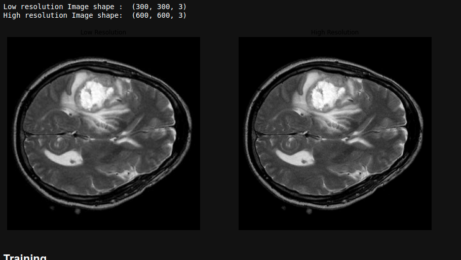
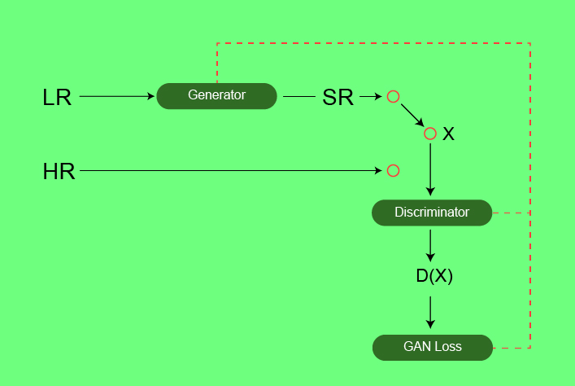

# Make your image better with this git
With the help of this git you are able to train your own custom dataset on EDSR or SR-Gans
These two algorithms are used for super resolution. which will convert your (150 * 150) px image to (600 * 600) image. In case you are not able to understand things email me or comment below. I will fix that issue out. Thank you

# Dataset

1. Download the dataset from Gdrive

        https://drive.google.com/drive/folders/1zKEvX3ubm19kHdWFQEpD6T-0NlCE6opp?usp=sharing

2. Training of Edsr

        This notebook help you in training edsr on your custom dataset like I used brain mris. I got images with 600 by 600 diminsion, Firstly I downsize them by 2x factor (300,300) now I got my low resoltion images as well as high resolution images, than I just feed them edsr model to make an image with diminsion (300,300) to (600, 600)

# Edsr model 

### Images I used for the training purpose

### Training Logs

### Nvidia GPU logs

# SR-Gans

**Super Resolution GAN (SRGAN)**

SRGAN was proposed by researchers at Twitter. The motive of this architecture is to recover finer textures from the image when we upscale it so that it’s quality cannot be compromised. There are other methods such as Bilinear Interpolation that can be used to perform this task but they suffer from image information loss and smoothing. In this paper, the authors proposed two architectures the one without GAN (SRResNet) and one with GAN (SRGAN). It is concluded that SRGAN has better accuracy and generate image more pleasing to eyes as compared to SRGAN.

Architecture: Similar to GAN architectures, the Super Resolution GAN also contains two parts Generator and Discriminator where generator produces some data based on the probability distribution and discriminator tries to guess weather data coming from input dataset or generator.  Generator than tries to optimize the genrated data so that it can fool the discriminator. Below are the generator and discriminator architectural details:

## Artitecture

## Loss Function SSRGANS:

The SRGAN uses perpectual loss function (LSR)  which is the weighted sum of two loss components : content loss and adversarial loss. This loss is very important for the performance of the generator architecture:

Content Loss: We use two types of content loss in this paper : pixelwise MSE loss for the SRResnet architecture, which is most common MSE loss for image Super Resolution. However MSE loss does not able to deal with high frequency content in the image that resulted in producing overly smooth images. Therefore the authors of the paper decided to  use loss of different VGG layers. This VGG loss is based on the ReLU activation layers of the pre-trained 19 layer VGG network. This loss is defined as follows

**Adversarial Loss:** The Adversarial loss is the loss function that forces the generator to image more similar to high resolution image by using a discriminator that is trained to differentiate between high resolution and super resolution images.

## Training Results:

# Conclusions
As from the numbers of validation losses computed while training. Edsr is performing better than SRGans. 

# Hardware and software compatibility.

    3070 RTX nvidia
    Intel 10400F processor (CPU)
    Ubuntu 18.04
    tensorflow 2.0

# Things to do

1. Will merge more models 
2. Fuse multiple model weights into one

# Took Help from 

1. Edsr Git https://github.com/krasserm/super-resolution
2. Tensorflow Documentation
3. Stack Overflow https://stackoverflow.com/users/7959545/sohaib-anwaar
4. Geeks for Geeks https://www.geeksforgeeks.org/super-resolution-gan-srgan/

**Git Progress:**
          
          v.0.0
          1. Researched about esdr
          2. Understanding of the code
          3. Change the data.py file (Data generator)
          
          v0.1
          1. Training of edsr on custom dataset (I used Medical Imaging dataset you can find data below in gdrive.)

          v0.2
          1. Researching on SR-gans
          2. Implementation and training of sr-gans
          
